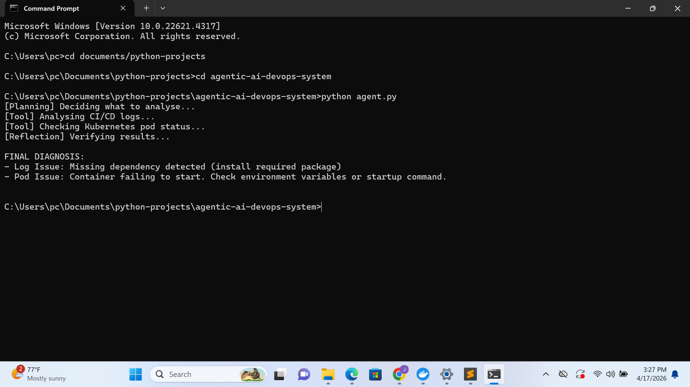

# agentic-ai-devops-system
MIM736 Assignment 2 Group 3
# Agentic AI DevOps System

## Overview

This project demonstrates the modernization of a legacy monolithic system into a cloud-native architecture and the development of an AI-powered DevOps agent.

## Features

* CI/CD log analysis
* Kubernetes pod inspection
* Automated issue diagnosis
* Agent reasoning: Planning → Tool → Reflection → Final Answer

## Project Structure

* `agent.py` – main agent logic
* `tools/` – log analysis and Kubernetes checks
* `Dockerfile` – containerization
* `k8s/deployment.yaml` – Kubernetes deployment
* `screenshots/` – execution proof

## Execution Evidence



## How to Run

```bash
python agent.py
```

## Docker Usage

```bash
docker build -t devops-agent .
docker run devops-agent
```

## Kubernetes

Deployment file available in:

```bash
k8s/deployment.yaml
```

##Contributors
#JORDAN ZVINYA
#FRANCIS KUSEMA
